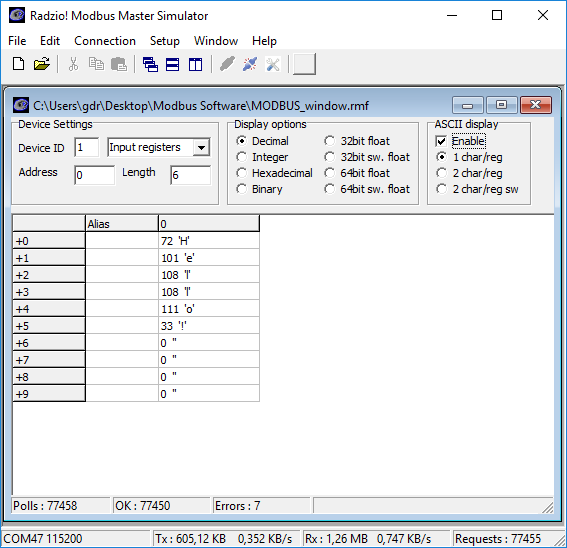
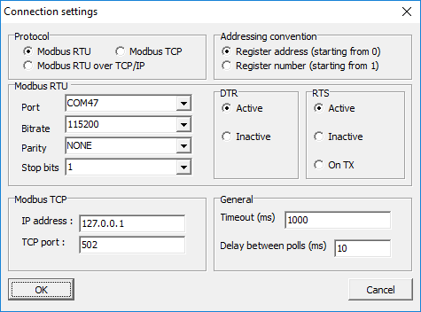
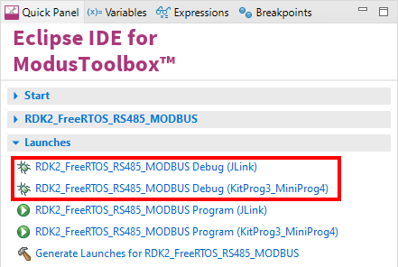

# RutDevKit-PSoC62 RS485 Modbus Example

Rutronik Development Kit Programmable System-on-Chip CY8C6245AZI-S3D72 "RS485 Modbus" Example. 

This example demonstrates the RS485 interface capabilities using Modbus protocol.

 

### Using the code example with a ModusToolbox IDE:

1. Import the project: **File** > **Import...** > **General** > **Existing Projects into Workspace** > **Next**.
2. Select the directory where **"RutDevKit-PSoC62_RS485_MODBUS"** resides and click  **Finish**.
3. Select and build the project **Project ** > **Build Project**.

### Operation

The FreeRTOS is used in this example to handle the modbus task where FreeModbus stack is initialized and polled every millisecond. Six Input Registers are initialized and prepared to be read by the master connected to the RutDevKit-PSoC62 RS485 port. The access to the rest of the modbus registers will be denied.

```
	/* Hello! */
	usRegInputBuf[0] =  'H';
	usRegInputBuf[1] =  'e';
    usRegInputBuf[2] =  'l';
	usRegInputBuf[3] =  'l';
	usRegInputBuf[4] =  'o';
	usRegInputBuf[5] =  '!';
```

The "Radzio! Modbus Master Simulator" software is used to simulate modbus master device and read the Input Registers from the address 0 to 6. The slave device ID is 1.




USB/RS485 Bridge settings Bitrate 115200 kb/s, parity NONE, stop bits 1.




### Debugging

If you successfully have imported the example, the debug configurations are already prepared to use with a the KitProg3, MiniProg4, or J-link. Open the ModusToolbox perspective and find the Quick Panel. Click on the desired debug launch configuration and wait until the programming completes and debugging starts.



## Legal Disclaimer

The evaluation board including the software is for testing purposes only and, because it has limited functions and limited resilience, is not suitable for permanent use under real conditions. If the evaluation board is nevertheless used under real conditions, this is done at one’s responsibility; any liability of Rutronik is insofar excluded. 


